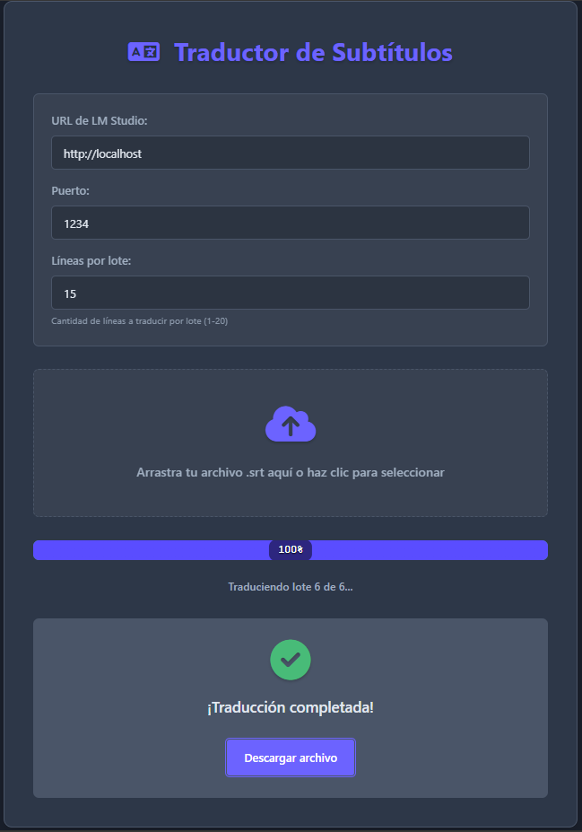

# Traductor de Subtítulos con LM Studio



Una aplicación web para traducir archivos de subtítulos (.srt) utilizando modelos de lenguaje locales a través de LM Studio. La aplicación ofrece una interfaz intuitiva con seguimiento de progreso en tiempo real.

## Características

- Interfaz web moderna y responsive con tema oscuro
- Traducción de archivos .srt a español
- Soporte para modelos de lenguaje locales a través de LM Studio
- Barra de progreso en tiempo real
- Control sobre el número de líneas por lote de traducción
- Descarga automática del archivo traducido
- Interfaz de arrastrar y soltar

## Requisitos Previos

- Python 3.8 o superior
- LM Studio ejecutándose localmente con un modelo de lenguaje cargado
  - **Modelo recomendado**: Llama-3.1-8b-instruct (ofrece un buen equilibrio entre velocidad y calidad de traducción)
- Navegador web moderno (Chrome, Firefox, Edge, etc.)

## Instalación

1. Clona el repositorio:
   ```bash
   git clone https://github.com/tuusuario/traductor-subtitulos.git
   cd traductor-subtitulos
   ```

2. Crea un entorno virtual (recomendado):
   ```bash
   python -m venv venv
   source venv/bin/activate  # En Windows: venv\Scripts\activate
   ```

3. Instala las dependencias:
   ```bash
   pip install -r requirements.txt
   ```

## Configuración

1. Asegúrate de tener LM Studio en ejecución con el modelo Llama-3.1-8b-instruct cargado. Este modelo ha demostrado ofrecer excelentes resultados en tareas de traducción.
2. Por defecto, la aplicación intentará conectarse a `http://localhost:1234`. Si usas una configuración diferente, ajústala en la interfaz web.

## Uso

1. Inicia la aplicación:
   ```bash
   python app.py
   ```

2. Abre tu navegador y ve a `http://localhost:5000`

3. Configura la conexión a LM Studio:
   - URL de LM Studio (por defecto: http://localhost)
   - Puerto (por defecto: 1234)
   - Líneas por lote (ajusta según la capacidad de tu sistema)

4. Arrastra y suelta un archivo .srt o haz clic para seleccionarlo

5. Espera a que se complete la traducción y descarga el archivo resultante

## Estructura del Proyecto

```
traductor/
├── app.py                # Aplicación principal de Flask
├── traductor_final.py    # Lógica de traducción
├── requirements.txt      # Dependencias
├── static/
│   ├── css/
│   │   └── style.css    # Estilos CSS
│   └── js/
│       └── main.js     # Código JavaScript del frontend
├── templates/
│   └── index.html     # Plantilla HTML
└── uploads/             # Directorio para archivos temporales
```

## Variables de Entorno

Crea un archivo `.env` en la raíz del proyecto para configuraciones personalizadas:

```
FLASK_APP=app.py
FLASK_ENV=development
UPLOAD_FOLDER=uploads
MAX_CONTENT_LENGTH=16777216  # 16MB
```

## Personalización

### Ajustar el modelo de lenguaje

El modelo recomendado para esta aplicación es **Llama-3.1-8b-instruct**, ya que ofrece un buen equilibrio entre velocidad y calidad de traducción. Para usar otro modelo, simplemente cárgalo en LM Studio y asegúrate de que el endpoint de la API sea accesible.

Puedes modificar el prompt de traducción en `traductor_final.py` en la función `traducir_lote` para adaptarlo a tus necesidades específicas o al modelo que estés utilizando.

### Cambiar el tema

Los estilos se encuentran en `static/css/style.css`. Los colores principales están definidos como variables CSS en la sección `:root`.

## Solución de Problemas

### La traducción no inicia
- Verifica que LM Studio esté en ejecución
- Asegúrate de que la URL y el puerto sean correctos
- Revisa la consola del navegador (F12) para mensajes de error

### La barra de progreso no avanza
- Intenta reducir el número de líneas por lote
- Verifica la conexión con LM Studio

## Contribuir

Las contribuciones son bienvenidas. Por favor, envía un pull request o abre un issue para discutir los cambios propuestos.

## Licencia

Este proyecto está bajo la Licencia MIT. Consulta el archivo [LICENSE](LICENSE) para más información.

## Créditos

- Desarrollado por [Tu Nombre]
- Utiliza [LM Studio](https://lmstudio.ai/) para la traducción de texto
- Interfaz construida con Flask y Vanilla JavaScript

---

¡Disfruta traduciendo tus subtítulos! Si te gusta el proyecto, considera darle una ⭐ en GitHub.
